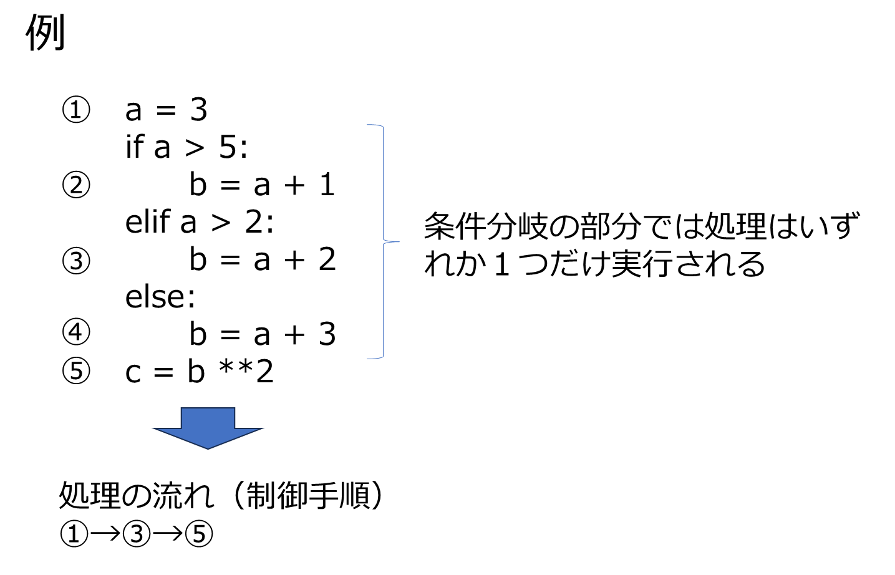

# 条件分岐
- 繰り返しと同様にプログラムの処理の流れを制御する
- 何らかの条件が成立する場合、しない場合とで処理内容を変えるもの
  
# 1. 比較演算子にもとづく条件分岐


```python
a = 5
if a != 5:
    print('aは5ではない')
else:
    print('aは5である')
    
if a == 5:
    print('aは5である')
else:
    print('aは5ではない')
    
import random
r=random.randint(1, 7)
print('乱数:',r)
if r>3:
    print(r)
else:
    print(r)

r=random.randint(1, 10)
print('乱数2:',r)
if r > 8:
    print('r > 8:',r)
elif r > 4:
     print('8 > r > 4:',r)
else:
    print('4 > r > 0:',r)
```

    aは5である
    aは5である
    乱数: 6
    6
    乱数2: 8
    8 > r > 4: 8
    

# 2.配列要素と条件分岐


```python

city = ['高崎市','前橋市','伊勢崎市','水上市']
if '高崎' in city:
    print('高崎')
elif '高崎市' in  city:
    print('高崎市')


# ielifの条件を満たしている場合でもifの条件を満たす場合は、ifが優先
takasaki ='高崎市'
if '高崎' in takasaki:
    print('高崎')
elif '高崎市' in takasaki:
    print('高崎市')


if  '前橋' not in takasaki:
    print('高崎')
else:
    print(takasaki)
    
    
```

    高崎市
    高崎
    高崎
    

<src img="cf86772c-2787-4f26-80b1-efb9350050bc.png" width="80%">




**aにいろいろな値を入れてどこで処理されるかを確かめてください**


```python
a = 3
if a > 5:
      b = a + 1
elif a > 2:
      b = a + 2
else:
      b = a + 3
a = b **2
print(a)
```

    25
    

**上記と同様にaに様々な値を入れて試してください**


```python
a = 3
if a > 5:
      b = a + 1
elif a > 2:
      b = a + 2

a = b **2
print(a)
```

    25
    

# 3. 複合条件


```python
a = 10
if a % 2 ==0 and a >8:
    print(a)


if a % 2 ==0 or a>20:
    print(a)

if a % 2 ==0:
    if a >= 10:
        print(a)
    
```

    10
    10
    10
    


```python
moji ='今日は晴れ'
if len(moji) >2:
     if '昨日' in moji:
         print('昨日は晴れ')
    
     else:
         print(moji)
        
if len(moji) > 2 and '昨日' in moji:
    print('昨日は晴れ')
else:
    print('今日は晴れ')
    
```

    今日は晴れ
    今日は晴れ
    

# 演習1.
1.　以下で生成した乱数（整数）が偶数ならば, '偶数', 奇数ならば'奇数'と表示するように条件分岐を記述せよ（生成した乱数自体も表示すること）
```
　　import random
    r=random.randint(1, 100)
```
2. 上記で生成した乱数について、偶数かつ50以上ならば、'偶数で50以上', 偶数かつ50未満なら　'偶数で50未満'　それ以外ならば何も処理しない条件分岐を記述せよ（生成した乱数自体も表示すること）
3. 上記2.の処理について、偶数かつ50以上、偶数かつ50未満の場合は同様とし，それ以外の場合は '奇数'と表示するように条件分岐を記述せよ
、


```python
import random
r=random.randint(1, 100)

```

    偶数
    90
    偶数で50以上
    90
    偶数で50以上
    90
    

4. 以下のような辞書型を用意しておき、1~7のいずれかの整数を乱数生成して該当する曜日を取り出し、土日ならば、'今日は〇〇曜日、休日です' を、
それ以外なら'今日は〇〇曜日、平日です' と表示するように条件分岐を記述せよ
```
{1:'日曜日',2:'月曜日',3:'火曜日',4:'水曜日',5:'木曜日',6:'金曜日',7:'土曜日'}
```


```python

```

    今日は土曜日、休日です。
    

5. 以下のようなnumpy型を用意しておき、0~6のいずれかの整数を乱数生成して該当する曜日を取り出し、土日ならば、'今日は〇〇曜日、休日です' を、
それ以外なら'今日は〇〇曜日、平日です' と表示するように条件分岐を記述せよ
```
np.array(['日曜日','月曜日','火曜日','水曜日','木曜日','金曜日','土曜日'])
```


```python


```

    今日は木曜日、平日です。
    

# 4. 繰り返し中での条件分岐
   

- continue : 条件を満たした場合、繰り返し中での後続処理を飛ばして次の繰り返しを行う
- break : 条件を満たした場合、繰り返しを打ち切る


```python
# 以下は同じ結果になる。インデントが多いと読みにくくなることがあるので、continueを使う
for i in range(10):
    if i % 2!=0:
       print(i)


for i in range(10):
    if i % 2==0:
        continue
    print(i)


```

    1
    3
    5
    7
    9
    1
    3
    5
    7
    9
    


```python
for i in range(10):
    if i > 3:
        break
    print(i)

i = 0
while True:
    print(i)
    i+=1
    if i > 3:
        break
```

    0
    1
    2
    3
    0
    1
    2
    3
    


```python
a = [ i for i in range(10) if i <= 3]
print(a)
```

    [0, 1, 2, 3]
    


```python
kisu =0
gusu=0
total=0
for i in range(10):
    if i % 2 == 0:
        gusu+=i        
    else:
        kisu+=i
    total +=i
print(kisu,gusu, total)
```

# 演習2.
1. input関数は、以下の通り、実行すると入力受付状態になり、何かの文字列を入力すると変数に受け取る関数である。input('文字を入力して下さい')　に対して、任意の文字を入力するとその文字を画面表示するという処理を繰り返し行うコーディング書け。ただし、input関数に対して'q'を入録した場合のみ、繰り返しを終了するように対応すること。


```python
a=input('文字列を入力：')
print(a)
```

    文字列を入力： 晴れ
    

    晴れ
    


```python

```

2. 以下のコーディングを結果が同じになるようにcontinueを使ったコーディングに修正せよ
```
byThree =[]
for i in range(10):
    if i % 3 == 0:
        print(i)
        byThree.append(i)
print(byThree)
```


```python


```

    0
    3
    6
    9
    [0, 3, 6, 9]
    0
    3
    6
    9
    [0, 3, 6, 9]
    

3. リスト内包表記を使って、上記byThreeと同じリストを作成して画面表示せよ


```python

```

    [0, 3, 6, 9]
    

4. 以下は月を要素とする配列である。これをfor文で逐次読み、冬の月ならば、'〇月は冬です' 夏の月ならば、'〇月は夏です' それ以外の月ならば何も処理しないように条件分岐を
記述せよ
```
[1,2,3,4,5,6,7,8,9,10,11,12]
```


```python

```

    1月は冬です
    2月は冬です
    6月は夏です
    7月は夏です
    8月は夏です
    12月は冬です
    


```python

```
